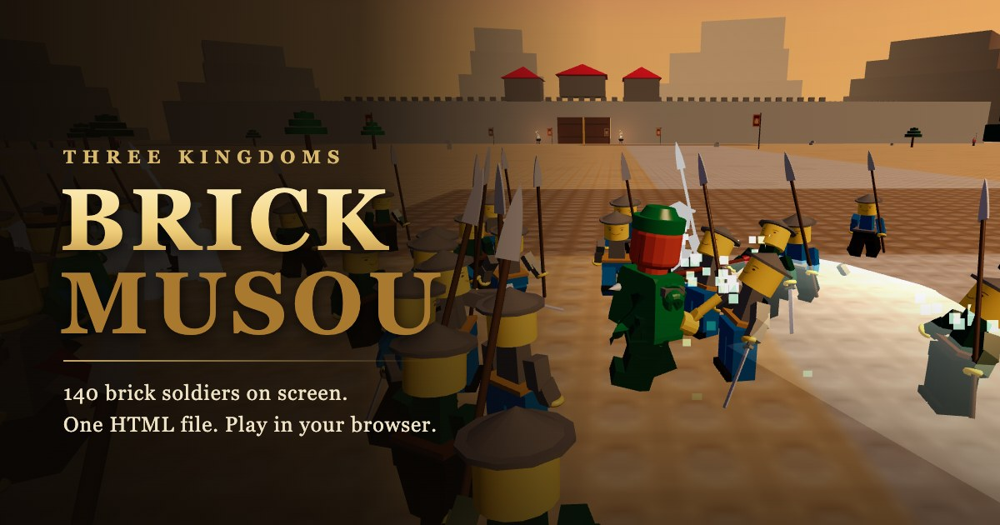

# BRICK MUSOU(積木無雙)

[English](README.md) | [繁體中文](README.zh-TW.md) | **日本語**

**▶ 今すぐプレイ:<https://brick.akiraxclaw.com>**(ミラー:<https://brick-warriors.vercel.app>)



**Three.js** で作った**ブロック風の三国志無双アクション**です。ゲーム全体が **HTML ファイル 1 つ**に収まっています。
武将と敵将はページに埋め込んだ本物の **LDraw ブロックパーツ**で組み立てています。雑兵・武器・馬・背景・アニメーション・
エフェクト・ポストプロセス・音楽・効果音はすべてコードでリアルタイム生成しているので、画像・モデル・音声ファイルは一切ありません。

- 同時に最大 **140 体のブロック兵**、全力で戦えば毎分 200 人以上撃破
- **3 ステージのキャンペーン**、**無限の陣(Endless Array)**、全世界で同じ条件になる**デイリーチャレンジ**
- **操作可能な武将 4 人**、それぞれ 36 技と専用の無双乱舞
- キーボード、**ゲームパッド**、**タッチ操作**(マルチタッチ対応の仮想スティック)
- 対応言語:英語 / 繁体字中国語(設定からいつでも切り替え可能。日本語 UI は未対応)

> ブロックのミニフィグはもともと剛体で、肘と膝は曲がらず、肩と股関節は 1 軸で回転するだけです。
> これがゲーム既存のポーズシステムとまったく同じ構造だったため、36 技の連続技・空中戦・ガード・騎乗といった
> 戦闘システムはコードを 1 行も変えずにそのまま使えました。

## クイックスタート

- **オンラインでプレイ**:<https://brick.akiraxclaw.com>
- **ローカルで実行**:ブラウザで `index.html` を開くか、フォルダをサーバーで配信します。

```bash
python3 -m http.server 8000
```

その後 <http://localhost:8000> を開いてください。Three.js r160 を CDN から読み込むため、インターネット接続が必要です。
ランキングには Vercel のバックエンドが必要です([ランキングと統計](#ランキングと統計)参照)。バックエンドがない場合は「未公開(not open yet)」と表示されます。

## キャンペーン ── 第一章:反董卓連合軍

タイトルメニューの **Sortie**(出陣)→ **キャンペーンマップ** → 武将選択 → 作戦ブリーフィング → 戦闘開始。
ステージごとにマップ・時間帯・敵将・BGM・目標が異なります。**◆ 主目標**を達成すると勝利です。
**◇ 副目標**を 1 つ達成するごとに評価が上がります。クリアすると次のステージが解放されます。

| ステージ | 舞台 | 主目標 | 副目標 | 敵将 |
|---|---|---|---|---|
| **汜水関の戦い** | 朝の山間の隘路、両側は断崖 | 陣営を 2 つ制圧 → 城門が開き**華雄が出陣** → 華雄を撃破 | 出陣から 60 秒以内に華雄を撃破(「酒が冷めぬうちに」)、全陣営を制圧 | 華雄 |
| **虎牢関の戦い** | 夕暮れの平原、両翼に大軍 | **呂布**を撃破(登場時に城門が開く) | 胡軫・李粛を撃破、全拠点を制圧 | 胡軫、李粛、呂布 |
| **洛陽追撃戦** | 夜、炎上する都 | **董卓**が北門から逃げる前に撃破(逃げられたら敗北) | 徐栄を撃破、400 人撃破 | 徐栄、董卓 |

- 汜水関と虎牢関は最初からプレイできます。洛陽は虎牢関をクリアすると解放されます。
- 虎牢関では**撃破数か経過時間のどちらか早い方**で展開が進みます。上級者は撃破数で先に進められ、初心者も時間経過で進行します。
- 評価(S/A/B/C)は撃破数・最大コンボ・残り体力・クリア時間・副目標・難易度から算出され、記録は「ステージ × 難易度」ごとに保存されます。

### 敵将の固有技

| 敵将 | 固有技 | 対策 |
|---|---|---|
| 華雄 | **突撃**:地面に直線の予告が出たあと、スーパーアーマー状態で高速突進 | 予告が見えたら横に避ける |
| 胡軫 | **弓兵の一斉射撃**:周囲 3 か所に矢の雨を降らせる | 赤い円から出る |
| 李粛 | **反撃の構え**:連続攻撃中に構える(金色の光)。構え中に攻撃するとガード不能の回転反撃 | 構えが見えたら手を止める |
| 徐栄 | **伏兵の煙幕**:煙の中で後退し、周囲に伏兵 6 人を呼ぶ | 無双乱舞で一掃 |
| 呂布 | 跳躍斬り(赤い円で予告)、旋風斬り、体力 35% 以下で狂暴化 | — |
| 董卓 | 北門へ逃走。追いつかれると 5〜7 秒反撃(ジャンプからの踏みつけ、ガード不能)し、また逃げる | ダッシュで追い、無双で一気に削る |

洛陽では**燃え落ちる瓦礫**もあります。赤い円の予告から 1.2 秒後に落下し、敵味方どちらにもダメージを与えます。

## 武将

| 武将 | 武器 | 特徴 | 無双乱舞 | フィニッシュ |
|---|---|---|---|---|
| 劉備(玄徳) | 雌雄一対の剣 | 最速の攻撃、滑らかな連携。バランス型 | **双龍乱舞**:前方へ突進(方向転換可)しながら二刀で交差斬り、前方 210° を攻撃 | 跳躍交差斬り、範囲 6.5 |
| 関羽(雲長) | 青龍偃月刀 | 最大の攻撃範囲、豪快な大振り | **青龍怒濤**:360° の大薙ぎ払いを 3 回、毎回衝撃波付き | 頭上からの叩き斬り、範囲 9 |
| 張飛(翼徳) | 蛇矛 | 最高の威力、溜め攻撃で地面を割る | **燕人咆哮**:地面を連続で突き、広がる衝撃波で周囲を打ち上げる | 大地割り、範囲 11 |
| 呂布(奉先) | 方天画戟 | いずれかのモードで**呂布を倒すと解放**。単騎出陣(味方なし) | **天下無双**:移動できる画戟の竜巻、0.9 秒ごとに地面を揺らす | 範囲 12 |

実測(大軍に囲まれた状態で発動):関羽は 1 回の無双で約 200 撃破、張飛は約 190、劉備は約 100。
劉備はスピード型で、その場で一掃するのではなく前へ突き進んで刈り取るため、撃破数は意図的に低めにしています。

選ばなかった 2 人は**味方武将**として一緒に出陣します(緑の名札、敵将クラスの強さ)。倒れても 25 秒ひざまずいたあと復帰し、
戦死することはありませんが、倒れるたびに士気が 8 下がります。

## ゲームモード

| モード | 内容 |
|---|---|
| **キャンペーン** | 上記 3 ステージ。 |
| **Quick Battle**(即出陣) | 前回のステージ・武将・難易度ですぐに開始。 |
| **60-Second Rush**(60 秒チャレンジ) | 60 秒でできるだけ多く撃破する。難易度は普通固定、同時に出る雑兵はどの端末でも 90 人固定なのでスコアを端末間で比べられる。敵将・ボス・ランダムイベントなし、開始時に無双ゲージ満タン。評価は S 600 / A 400 / B 200 撃破、専用ランキングあり。 |
| **Endless Array**(無限の陣) | 40 秒ごとに次の波が来る無限ウェーブ。波ごとに敵の体力 +7%、攻撃 +5%。3 波ごとに敵将、6 波ごとに呂布が再来。第 12 波到達で評価 S。 |
| **Daily Challenge**(デイリー) | 日付をシードにして、**その日は全世界で同じ武将・難易度・変異**になり、開始時の敵兵 48 人の配置も同じ。連続挑戦日数を記録。 |

**デイリー変異**(毎日 1 つ):Arrow Storm(弓兵 2 倍)・Iron Wall(敵の体力 +35%)・Bloodlust(無双ゲージ +70%)・
Last Stand(体力 −40%、攻撃 +30%)・Low Morale(拠点が士気に影響しない)。

> デイリーは**フレーム単位で完全一致するわけではありません**。同時表示の敵数は端末の性能に応じて自動調整されるため、
> スマホと PC がまったく同じ戦いになることはありません。固定されるのは武将・難易度・変異・開始時の配置です。

## 成長とコレクション

- **武将レベル 1〜20**:自分で倒すと経験値を獲得(雑兵 1、敵将 25、ボス 150。燃焼・連鎖雷での撃破も含む)。
  クリア時は評価に応じたボーナスもあります。1 レベルごとに体力 +2%、攻撃 +1.5%、無双回復 +1% で、戦闘中のレベルアップも即反映。
  味方の撃破とタイトル画面のデモでは経験値は入りません。
- **戦功(実績)26 種**:戦闘・キャンペーン・モード・コレクションの 4 分類。**Achievements** 画面で進捗を確認できます。
- **衣装**(戦功で解放):劉備の白袍、関羽の金甲、張飛の黒甲、呂布の赤甲。武将選択画面で **C**(パッドは △)で切り替え。
- **武器の成長**:敵将と呂布は必ず光る**武器箱**を落とします。1 つ拾うごとに武器レベル +1(最大 10、1 レベルごとに攻撃 +6%)と属性が付きます。
  武器の進行状況はプレイをまたいで保存されます。

| 属性 | 効果 |
|---|---|
| **炎** | 3 秒間燃焼し、0.5 秒ごとにダメージ |
| **雷** | 18% の確率で近くの敵最大 3 人に連鎖 |
| **氷** | 3 秒間 40% 減速、12% の確率で凍結 |

## 戦闘

### キーボードとマウス

| キー | 操作 |
|---|---|
| `WASD` / 矢印キー | 移動 |
| `J` / `Z` / 左クリック | 通常攻撃(**6 段コンボ**) |
| `K` / `X` | **チャージ攻撃**:立ち状態で C1、N 段目のあとで C(N+1)、C1〜C6 |
| `スペース` | ジャンプ(空中で `J` = 空中連斬、空中で `K` = 叩きつけ衝撃波) |
| `H` / 右クリック(長押し) | **ガード**:正面のダメージ −85%。構えてから 0.15 秒以内に被弾すると**パーフェクトガード**(ダメージ無効、時間停止、無双 +12、次の一撃 ×1.5) |
| `L` / 中クリック | **無双乱舞**(ゲージ満タン時。コンボ中・被弾中でも発動可) |
| `R` | 乗馬 / 下馬(馬の近くで) |
| `Shift` | ダッシュ |
| `Q` / `E` | カメラ回転 |
| `M`・`Esc`・`Tab` | ミュート・ポーズ・難易度切り替え(武将選択画面) |

### チャージ攻撃(全武将で意味は共通、動きと範囲は武器ごとに異なる)

| 技 | 入力 | 効果 |
|---|---|---|
| C1 | 立ち状態で K | ガードを崩す突進、盾兵を貫通 |
| C2 | 1 段目のあと | **打ち上げ**、空中コンボへ |
| C3 | 2 段目のあと | 3 連撃、最後の一撃で 2.6 秒**気絶** |
| C4 | 3 段目のあと | 大回転、周囲を吹き飛ばす |
| C5 | 4 段目のあと | 斬り上げから薙ぎ払い |
| C6 | 5 段目のあと | 広範囲の衝撃波で周囲をすべて吹き飛ばす |

### ゲームパッド(Xbox / PlayStation / XInput、接続するだけで使用可能)

| ボタン | 操作 |
|---|---|
| 左スティック / 十字キー | 移動(**アナログ**:倒すほど速く走る) |
| 右スティック・`L2` `R2` | カメラ |
| `□`/`X`・`△`/`Y`・`×`/`A`・`○`/`B` | 攻撃・チャージ・ジャンプ・無双 |
| `R1`/`RB`・`L1`/`LB`・`L3` | ガード・ダッシュ・乗馬 |
| `Start`・`Select` | ポーズ・難易度切り替え(武将選択画面) |

### タッチ操作(スマホ / タブレット)

画面左半分をドラッグすると**フローティング仮想スティック**、右半分の空いている所をドラッグするとカメラ操作です。
ボタン:**ATK**(長押しで連打)、**C**、**JMP**、**MUSOU**、**GRD**(長押し)、**MNT**、右上の **Ⅱ** でポーズ。
マルチタッチ対応なので、移動しながら攻撃できます。出陣時はフルスクリーン・横画面推奨で、タッチ端末は中画質から始まります。
ボタンのサイズと透明度は調整できます。

### 乗馬

戦場に馬が待機しています。近づいて `R` を押すと乗れます。移動速度 12(ダッシュ時 16)、速度が出ていると進路上の敵を**蹴散らします**。
`J` で左右交互の斬撃、`K` で突進攻撃。

### 拠点と士気

汜水関には陣営が 3 つ、虎牢関には拠点が 4 つあり、開始時はすべて董卓軍のものです。各拠点には**守備兵**(基本 40)がいて、
拠点の近くで敵を倒すと減っていきます(雑兵 1、敵将 6)。0 になると制圧で、旗が変わり、奪い返されることはありません。
制圧した拠点の数で**士気**が決まります(0 か所 → 38、全制圧 → 90)。士気が低いと敵の出現が増え、
高いと背景の大軍の戦線が目に見えて城門へ押し上がります。

### 敵と戦場イベント

- **刀兵 / 槍兵**:基本の雑兵。交代で攻撃してくる
- **弓兵**(12 撃破後に登場):距離を取って射撃。前に味方がいると撃たない
- **盾兵**(20 撃破後に登場):正面 120° の通常攻撃を防ぐ。チャージ攻撃・無双・背後からの攻撃が有効
- **騎兵突撃**:地面に赤い進路の予告が出たあと、騎兵が進路上の全員を跳ね飛ばす
- **矢の雨**と**敵の挟撃**:ディレクターの緊張度システムが戦況に応じて発生させる。
  コンボが続いて撃破が速いと難しくなり、体力が 30% を切ると 8 秒間ゆるめる

敵は**肉まん**(体力回復)と**酒**(無双回復)を落とします。敵将を倒すとスローモーションで回り込むカメラ演出が入ります。
コンボ 10/30/60/120 で称号、撃破数 50/100/200/300/500/1000 でメダルが表示されます。

## 難易度

| 難易度 | 敵の体力 | 敵の攻撃 | 敵の数 | ボスの体力 |
|---|---|---|---|---|
| Easy(易) | ×0.75 | ×0.45 | ×0.72 | ×0.75 |
| Normal(普通) | ×1 | ×1 | ×1 | ×1 |
| Chaos(修羅) | ×1.35 | ×1.5 | ×1.2 | ×1.6 |

## ガイドと演出

- **作戦ブリーフィング**:史実の背景、主目標と副目標、上から見た地図(城門、拠点、董卓の逃走ルート、自軍の位置)。
  Quick Battle とリトライでは省略されます。
- **状況に応じたチュートリアル**:初回プレイ時に 1 つずつ操作を案内します(移動 → コンボ → チャージ → ガード → 無双 →
  拠点 → 敵将 → 乗馬 → ジャンプ)。キーボード / パッド / タッチに合わせた表記で、その操作をすると消えます。設定でオフや再表示が可能です。
- **会話**:ブロック顔のポートレートとセリフ。開幕、敵将の登場と撃破、ボス登場、味方の転倒、ピンチ、勝利、董卓が北門に近づいたときに表示されます。
- **ステージ別 BGM**:汜水関は明るい 104 BPM、虎牢関は 96 BPM、洛陽は緊迫した 118 BPM の追撃ビート。
- **戦績シェアカード**(リザルト画面で `S`):その瞬間の戦場から 1200×630 のカードを合成(ポートレート、モード、評価、撃破数、コンボ、時間)。
  シェア(スマホは Web Share)、画像コピー、ダウンロード、ゲームのリンク付き 1 行テキストのコピーができます。

## ランキングと統計

- **ランキング**:デイリー(1 日 1 つ)、Endless(波数、次に撃破数で比較)、60 秒チャレンジ(撃破数)、各ステージ × 難易度。
  **リザルト画面で「Submit Score」を押したときだけ送信**されます。端末ごとに各ランキングのベスト記録だけを保持し、ニックネームを変えると記録も引き継がれます。
- **サーバー側のチェック**:クリア時間 15〜3600 秒、時間に対する撃破数・コンボ・波数の上限、IP ごとに 1 分 12 回まで。
  ブラウザゲームで不正を完全に防ぐことはできないため、明らかにあり得ない記録だけを弾きます。
- **自前の統計**:外部スクリプトは読み込まず、個人データも保存しません。サーバーに残るのは日ごとの合計だけです:
  開始数、勝敗とプレイ時間、敗北したタイミング、評価、Endless の波数、途中離脱、言語と端末の種類。
- **バックエンド**:`api/score.js`、`api/event.js`、`api/stats.js`(Vercel Functions)と Upstash Redis。
  **データベースがない場合**、API は `503 {enabled:false}` を返し、ゲーム内ランキングは「not open yet」と表示され、登録欄は非表示になります。他の機能には影響しません。
- **セットアップ**:Vercel プロジェクト → Storage / Marketplace → **Upstash Redis** を追加してプロジェクトに接続
  (`KV_REST_API_URL` / `KV_REST_API_TOKEN` が自動で設定されます)→ 再デプロイ。統計を見るには `STATS_TOKEN` を設定し、
  `/api/stats?days=7&token=…` を開くと、ステージ・難易度ごとのプレイ数、勝率、平均クリア時間、途中離脱数を確認できます。
- **ローカルテスト**:`.claude/serve.mjs` にはメモリ上の Redis モックが入っているので、`/api/*` がローカルでも動きます。
  `POST /__mock?on=0` で「未設定」を再現、`?reset=1` でデータを消去します。

## 設定と言語

既定の言語は英語で、設定から繁体字中国語に切り替えられます(再読み込み不要)。旧バージョンのセーブは一度だけ英語に切り替わり、
その後に中国語を選べば記憶されます。武将名・称号・武器・敵将・拠点・難易度・属性・コンボ称号・メダルはすべて翻訳済みです。

設定項目(`localStorage` に保存):マスター / BGM / 効果音の音量・画質(FPS に応じた自動 / 高 / 中 / 低)・
カメラ感度と反転・画面の揺れ 0〜150%・パッドの振動とデッドゾーン・ダメージ数値・チュートリアル・
タッチボタン(自動 / オン / オフ)、サイズと透明度・セーブデータの消去。

## セルフテスト

URL に **`?selftest`** を付けるか(例:<https://brick.akiraxclaw.com/?selftest>)、コンソールで `await GAME.selftest()` を実行します。
ページ内で `tick()` を使ってゲームを早送りし、**31 のシナリオ**を約 15〜20 秒で実行します。

- **システム**:タイトル画面のデモ、戦闘開始後に入力が残らない、全武将の開始、全無双、Endless、デイリー、ポーズ → 設定の保存、
  言語切り替え、タッチ、ゲームパッド、コンソールエラーなし
- **成長とコレクション**:呂布ロック → 撃破で解放 → 単騎出陣と天下無双、レベルとセーブ、戦功と衣装、武器箱でレベル補正が消えない
- **ガイドと演出**:会話の順番と BGM の切り替え、ブリーフィング、チュートリアル
- **ステージ進行**:虎牢関の目標と城門、汜水関の陣営制圧 → 華雄出陣 → 60 秒制限(失敗も含む)、敵将の固有技、
  洛陽の逃走 → 追いつく → 徐栄の殿 → 撃破、董卓に逃げられたら敗北、燃える瓦礫、キャンペーンマップ → 記録 → 次のステージ、
  勝利リザルトとシェアカード、敗北
- **オンライン**:ランキングの有効判定、登録欄の表示・非表示、ニックネーム入力中にゲームのキーが反応しない、ランキング画面の操作、
  サーバーがあり得ない記録を拒否すること。ローカル(モックDB)では登録・改名・読み戻し・統計も検証します。
  本番環境では読み取りのみで、ランキングには書き込みません。
- **バランス回帰**:実際の入力だけを使う模擬プレイヤーで「60 秒以内に陣営を必ず制圧できる」「Normal で董卓に追いつける」を検証。
  どちらも実際の進行不能バグを見つけたことがあります。

各テストは固定の乱数シードを使い、終了後に `localStorage`(`musou.*`)・設定・言語・ゲームパッドを元に戻します。
わざとゲームを壊してテストが失敗することを確認済みです。`GAME.selftest({only:'無雙'})` で名前にキーワードを含むテストだけを実行できます(テスト名は中国語)。

## 技術メモ

- **データ駆動のステージ**:`STAGES.<id>` にアリーナ、出現位置、敵将とボスの登場タイミング、拠点、背景の軍勢、兵種の解禁、
  イベント、目標、ライティング、シーン構築関数を記述します。`loadStage()` は古いワールドを破棄(キャッシュ外の GPU リソースのみ解放)して再構築します。
  ハードコードされていた虎牢関をこの仕組みに移したときは、17 項目の構造フィンガープリントで比較し、差分ゼロを確認しました。
- **目標システム `OBJ`**:defeat / capture / kills。`after`、`within`(ゲーム内時間で計測するので、スローモーションや演出で時間を失わない)、
  `optional`、`final`、独自の失敗条件に対応。
- **背景キット `propKit`**:地面、ヒンジ式の城門を持つ関所、峡谷の岩壁、段々のブロック山、燃える家屋、旗、篝火、陣幕、柵、櫓。
  ブロックは色ごとにメッシュを結合するので、山並み全体でも数回のドローコールで済みます。
- **統一入力レイヤー**:`input.keys` は Proxy で、読み取り時に「キーボード ∪ ゲームパッド」を返します。ゲームパッド・タッチ・タイトル画面の bot は
  すべて同じキーコードとアナログ軸を合成するため、追加しても戦闘コードは一切変更していません。
- **多言語対応**:`I18N.zh` / `I18N.en` と `T(key, …args)`。データテーブルは `en:{…}` を持ち、`LN(obj, field)` で取り出します。
  静的な DOM は `data-t` / `data-th` / `data-tp` で指定します。
- **大軍の描画**:背景の軍勢(InstancedMesh 4 個 × 200)、操作対象の雑兵(性能段階に応じて上限 60 / 100 / 140)、InstancedMesh の死体プール。
  雑兵のパーツは関節ごとに頂点カラーで焼き込んで 1 メッシュに結合(ドローコール 21 → 10)。雑兵 160 体で 1 フレーム約 4.6ms。
- **武将モデル**:頭・胴体・腕・脚は LDraw パーツです。鎧・顔・マントのプリントは読み込み時に canvas で描き、頭飾り・ひげ・肩当てはコードで造形しています。
  武将・敵将・董卓はそれぞれ `V2` テーブルの 1 項目で、同じ関節の下の静的パーツは結合します。雑兵はわざと彩度の低い敵軍色に統一し、武将が大軍の中で目立つようにしています。
  URL に **`?v1`** を付けると旧来の無地モデルに戻せます。
  タッチ端末ではプリントを半分の解像度で描きます(テクスチャメモリは 4 分の 1 で、スマートフォンの画面では見分けがつきません)。
  ステージの敵将とボスは開始カードの間に先に組み立てるので、登場時にカクつきません。
- **密度の維持**:敵は城門からではなく、プレイヤーを中心とした半径 13〜23 の円周上に出現します。遠い兵は速く移動して追いつき、
  はぐれた兵は再配置され、攻撃範囲の内側を回り込みます。緊張度システムが制限するのは同時に攻撃してくる人数だけで、その場にいる人数は減らしません。
- **パフォーマンス自動調整**:`PERF` がヒステリシス付きで 3 段階を切り替えます(ブルーム、影、pixelRatio、敵の上限、軍勢の規模)。
- **レンダリング**:EffectComposer + UnrealBloomPass(HDR しきい値を 1.0 より上にしてエフェクトだけを光らせる)、ACES Filmic、4× MSAA の half-float。
  マントと戦裙は verlet 布シミュレーション。音楽と効果音はすべて Web Audio で合成。
- **シェア画像の取得**:レンダラーは `preserveDrawingBuffer` を使いません。リザルト画面で描画直後の同じタスク内で `drawImage` するため、
  戦闘中にスクリーンショットのための負荷はかかりません。

### デバッグコンソール

```js
GAME.step(5)                   // 5 秒早送り(GAME.step(5,{render:false}) で描画なし)
GAME.PERF.force(0)             // 最低性能段階に固定
GAME.setDiff('shura')          // 難易度を変更
GAME.cavalry(); GAME.arrowRain(); GAME.flank()   // イベントを手動で発生
GAME.director.P                // 現在の緊張度
GAME.spawnDrop(GAME.player.pos,'wbox','fire')    // 炎属性の武器箱を出す
GAME.bases; GAME.morale.v; GAME.MOUNT            // 拠点・士気・馬の状態
```

## クレジット

ミニフィグのパーツ形状は **[LDraw.org パーツライブラリ](https://library.ldraw.org/)**(ライセンス:
**[CC BY 4.0](https://creativecommons.org/licenses/by/4.0/)**)のもので、
[gkjohnson/ldraw-parts-library](https://github.com/gkjohnson/ldraw-parts-library) のミラーから取得し、オフラインで展開して `index.html` に埋め込んでいます。

それ以外(雑兵、馬、武器、背景、テクスチャ、アニメーション、エフェクト、音楽、効果音)はすべて本プロジェクトのコードで生成しています。

BRICK MUSOU は個人によるファン作品であり、**LEGO グループとは一切関係がなく、スポンサーや承認も受けていません**。
LDraw はコミュニティが管理するオープンなブロック CAD ライブラリで、こちらも LEGO グループとは無関係です。
